University: [ITMO University](https://itmo.ru/ru/)
Faculty: [FICT](https://fict.itmo.ru)
Course: [Введение в веб технологии](https://itmo-ict-faculty.github.io/introduction-in-web-tech/)
Year: 2025/2026
Group: u4225
Author: Тузовская Арина Сергеевна
Lab: Lab0
Date of create: 01.10.2026
Date of finished: 

## Цель работы

Научиться создавать репозитории, настраивать рабочее окружение и изучить основы работы с Git и GitHub.

## Ход работы

### 1. Установка Git и настройка SSH-ключей

Git был установлен через инструменты командной строки Xcode на macOS. Затем настроены имя пользователя и email для подписи коммитов, а также сгенерирован SSH-ключ типа ed25519 для безопасной работы с GitHub.

Проверка версии Git и успешная аутентификация на GitHub:

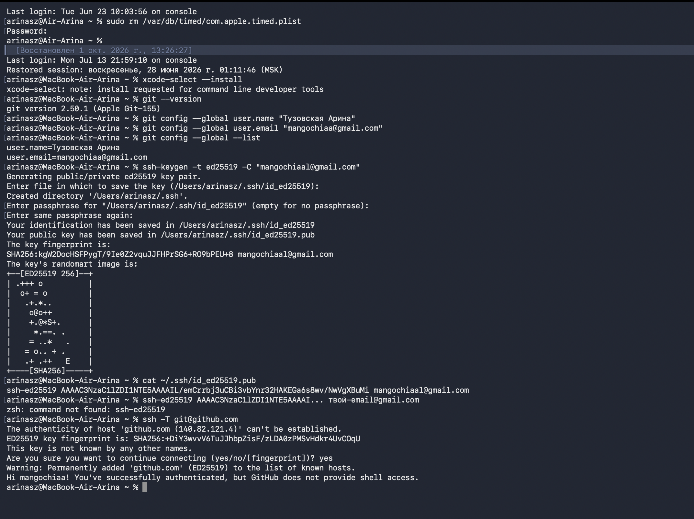

SSH-ключ добавлен в настройки аккаунта GitHub:

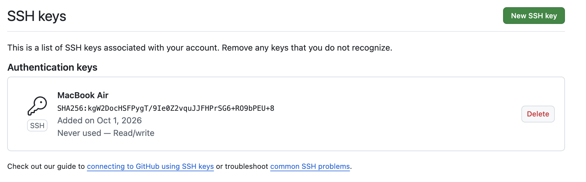

### 2. Создание репозитория на GitHub

Был создан публичный репозиторий `devops-lab-tuzovskaya`. При создании не были выбраны автоматические файлы (README, .gitignore, LICENSE), чтобы настроить проект вручную.

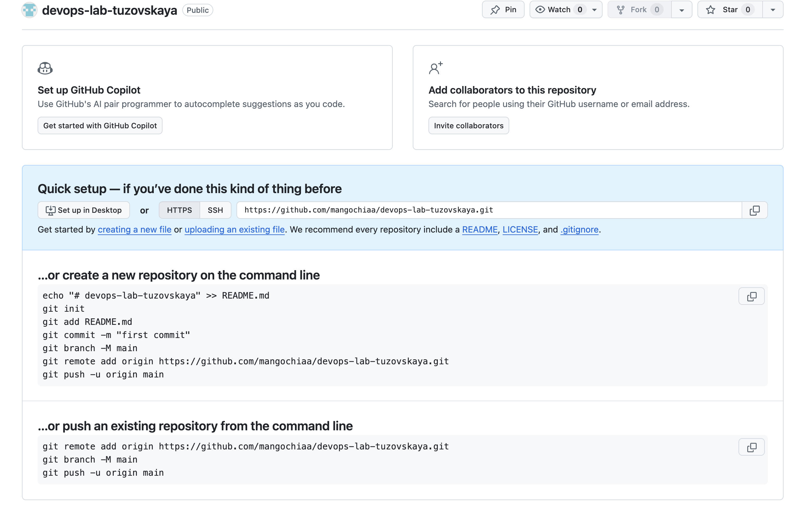

### 3. Клонирование репозитория

Репозиторий был клонирован на локальный компьютер в папку `~/Projects/devops-lab-tuzovskaya` с помощью команды:
git clone git@github.com:mangochiaa/devops-lab-tuzovskaya.git

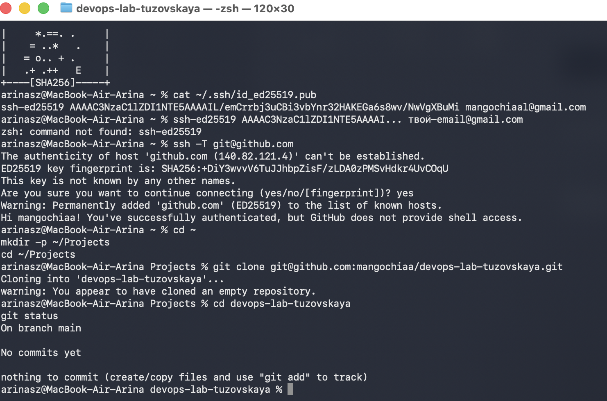

### 4. Создание файла README.md

С помощью редактора `nano` был создан файл `README.md` с описанием проекта, контактными данными и планом изучения DevOps.

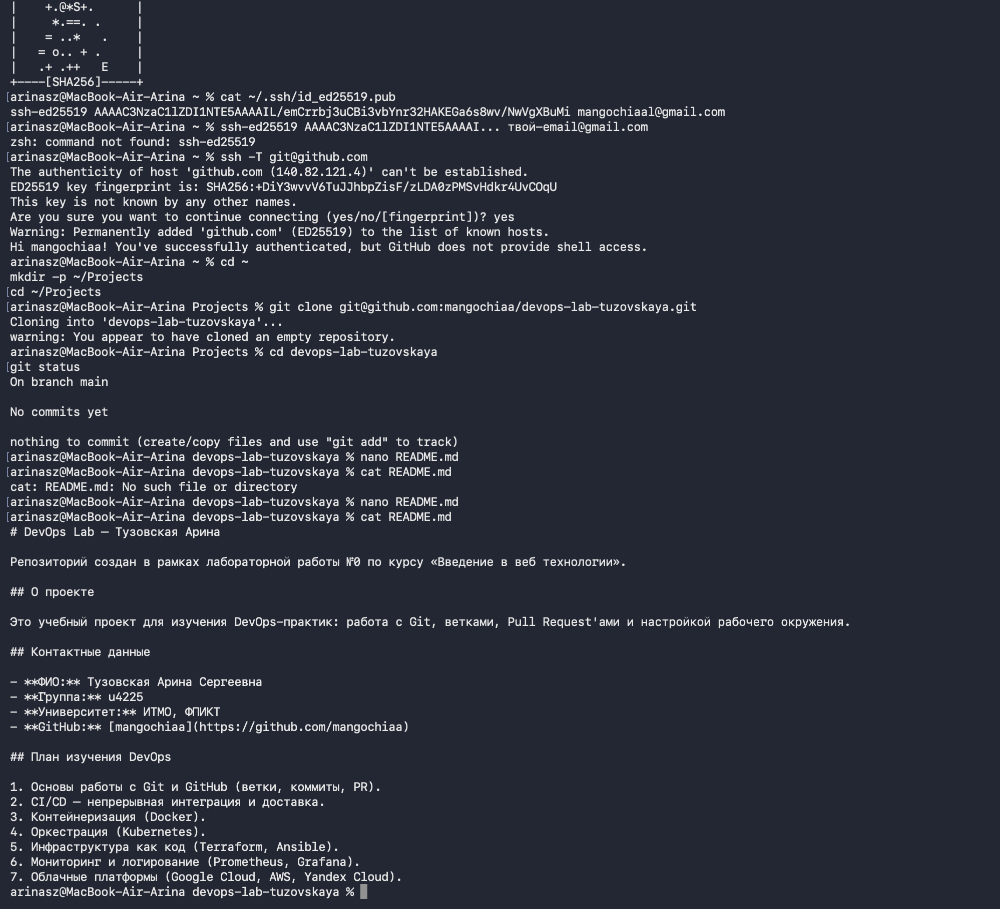

### 5. Создание файла .gitignore

Был создан файл `.gitignore` с исключениями для macOS (`.DS_Store`, `._*`, `**/.DS_Store`), IDE (`.idea/`, `.vscode/`, `*.swp`), логов, `.env`-файлов, а также для Node.js и Python.

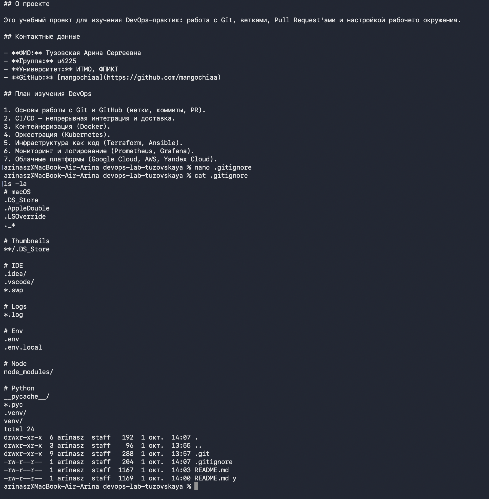

### 6. Первый коммит в main

Файлы `README.md` и `.gitignore` были добавлены в индекс и закоммичены с сообщением `Initial project setup`, после чего отправлены в удалённый репозиторий:
git add .
git commit -m "Initial project setup"
git push origin main

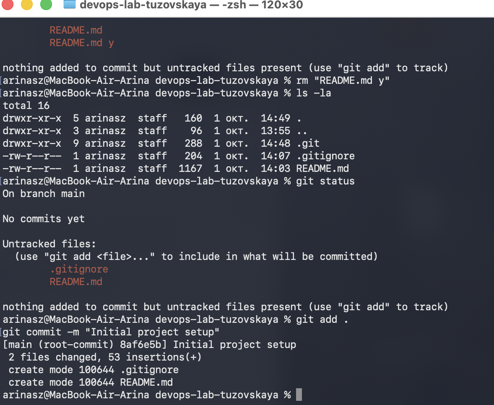

### 7. Создание ветки develop

Была создана и активирована ветка `develop` для дальнейшей разработки:
git checkout -b develop

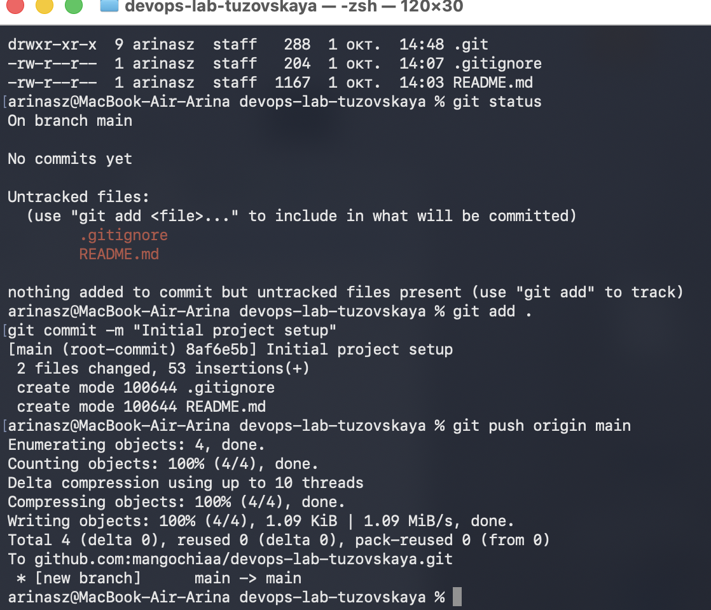

### 8. Создание файла CONTRIBUTING.md

В ветке `develop` был создан файл `CONTRIBUTING.md` с правилами участия в проекте: как создавать ветки, стиль коммитов, правила код-ревью.

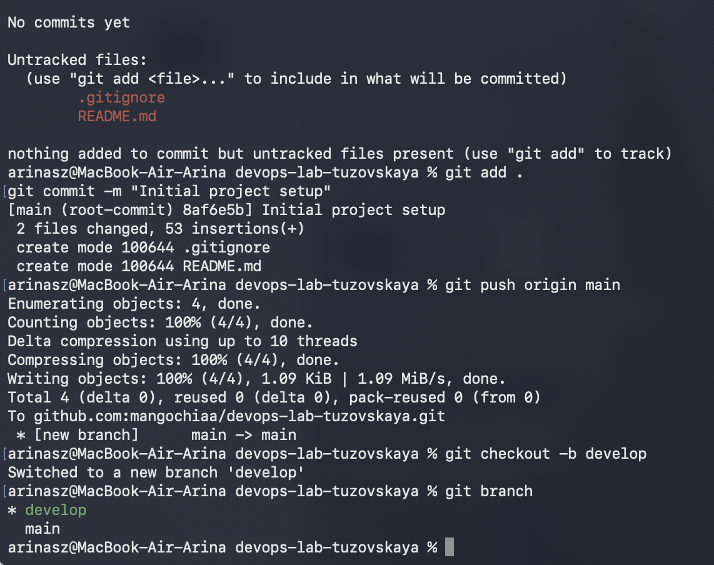

### 9. Коммит и push в develop

Изменения были закоммичены и отправлены в удалённую ветку `develop`:
git add .
git commit -m "Add CONTRIBUTING.md"
git push -u origin develop

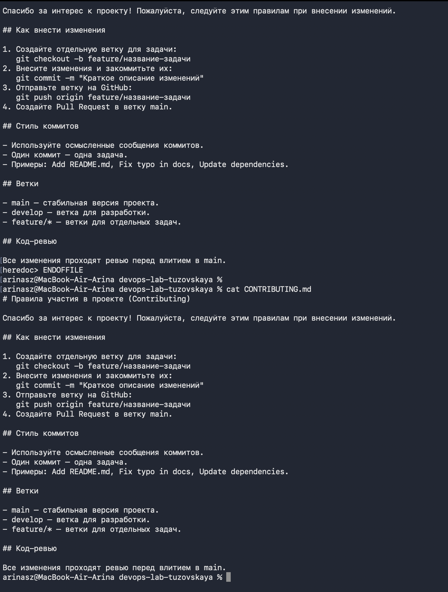

### 10. Создание Pull Request

Через веб-интерфейс GitHub был создан Pull Request из ветки `develop` в `main` с описанием внесённых изменений.

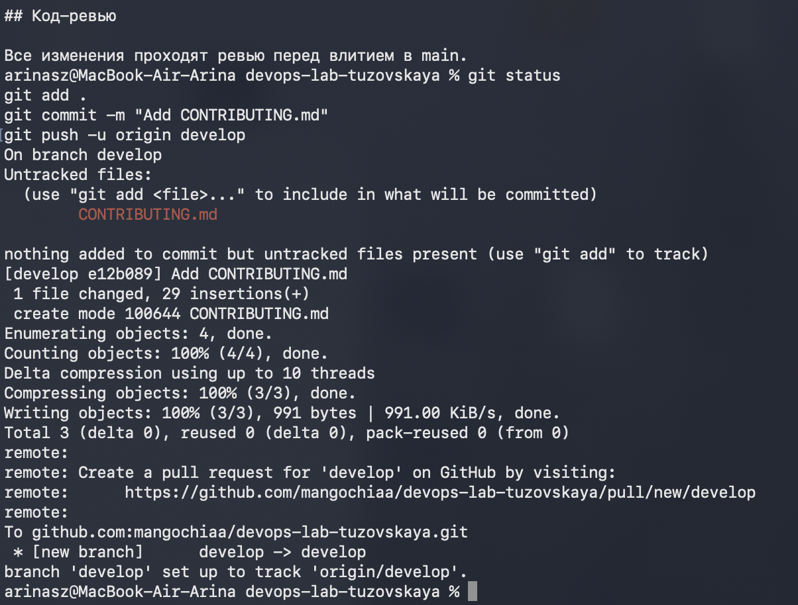

### 11. Мерж Pull Request и удаление ветки

Pull Request был успешно смержен в `main`, после чего ветка `develop` удалена как из удалённого репозитория, так и локально:
git checkout main
git pull
git branch -d develop

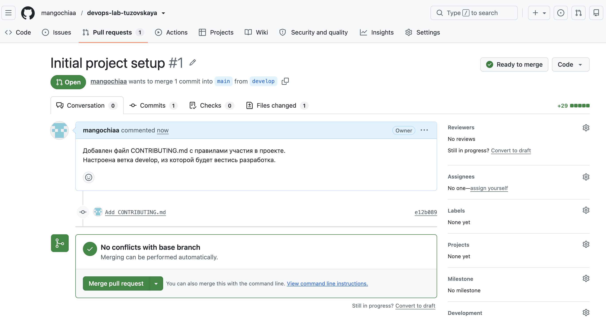

### 12. Итоговая структура репозитория

Репозиторий `devops-lab-tuzovskaya` содержит файлы `README.md`, `.gitignore`, `CONTRIBUTING.md` и историю коммитов.

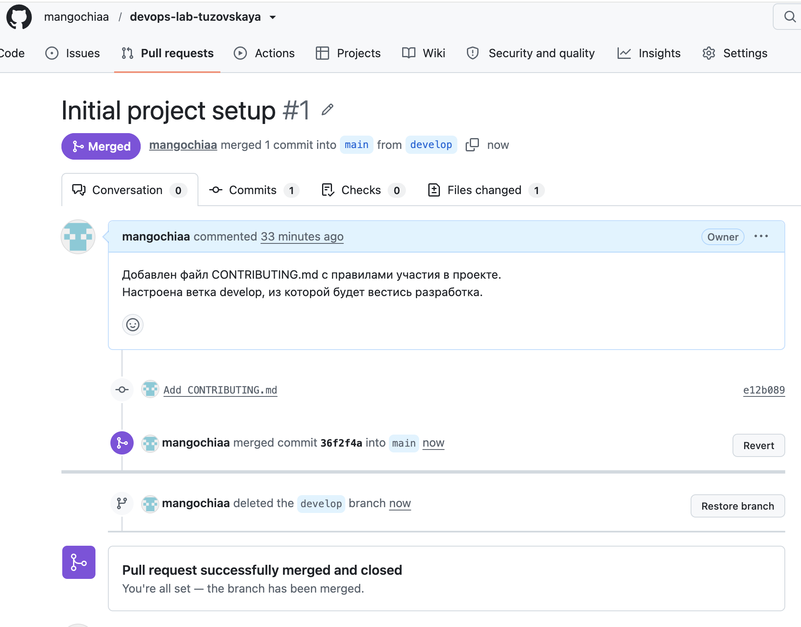

## Вывод

В ходе лабораторной работы я настроила рабочее окружение для работы с Git и GitHub: установила Git, сгенерировала и добавила SSH-ключ в аккаунт GitHub, настроила имя пользователя и email.

Я освоила базовый рабочий процесс разработчика:
- Клонирование удалённого репозитория (`git clone`);
- Создание и редактирование файлов (`nano`);
- Работа с индексом Git (`git add`, `git status`);
- Создание коммитов с осмысленными сообщениями (`git commit`);
- Отправка изменений в удалённый репозиторий (`git push`);
- Создание и переключение между ветками (`git checkout -b`);
- Создание Pull Request и его мерж через GitHub;
- Удаление ветки после мержа.

**Ключевой вывод:** использование веток и Pull Request — это основа командной работы в DevOps. Ветка `develop` позволяет вести разработку изолированно от стабильной ветки `main`, а Pull Request даёт возможность провести код-ревью перед влитием изменений. Такой workflow предотвращает случайное попадание неоттестированного кода в стабильную версию проекта.
