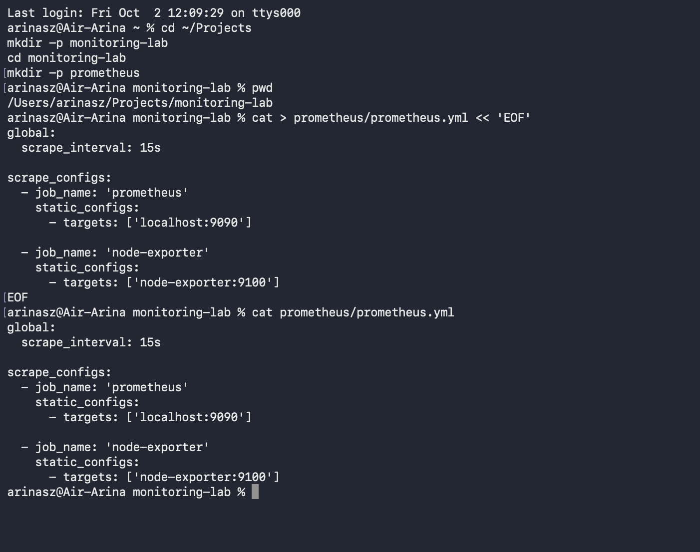
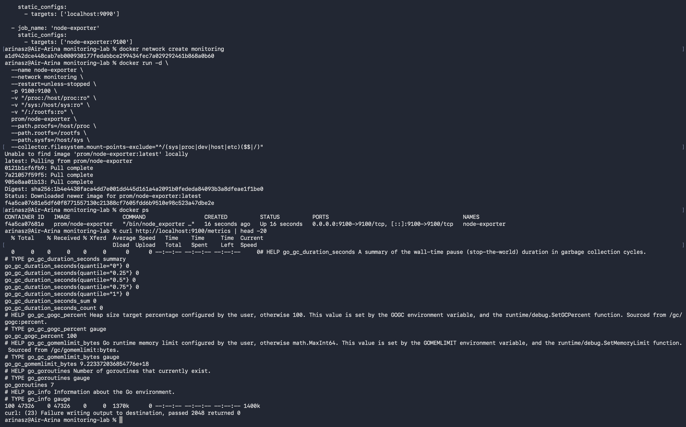
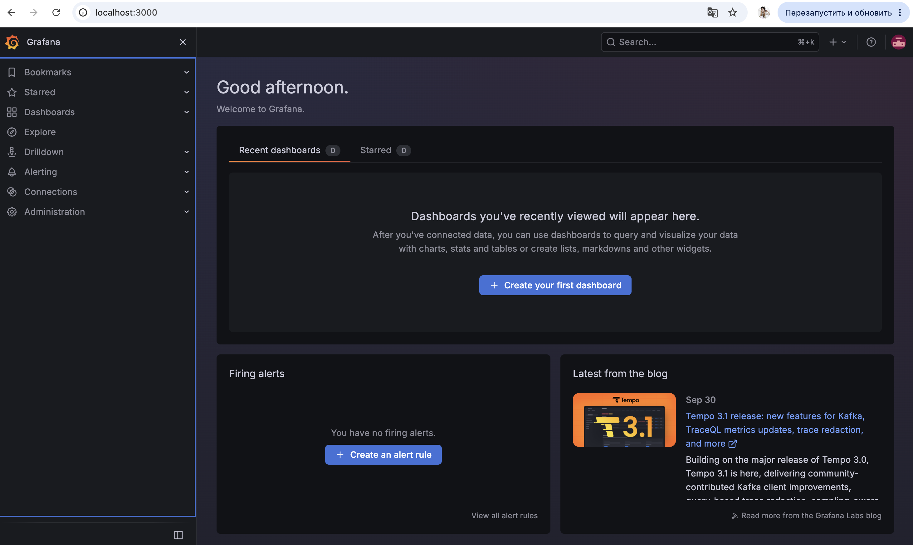
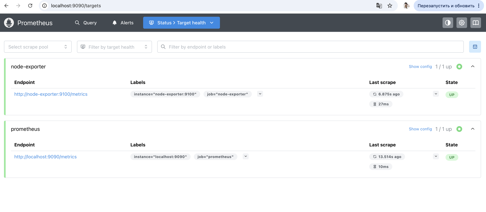
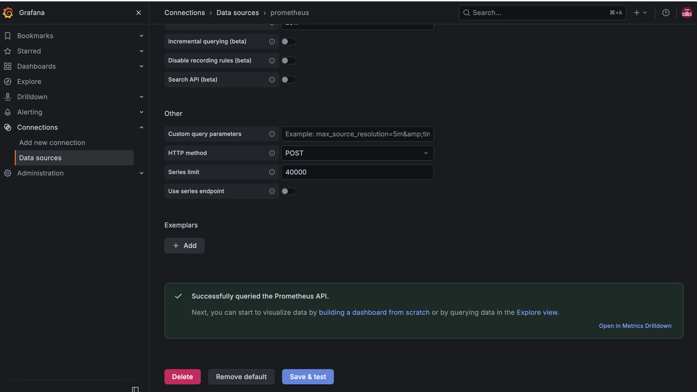
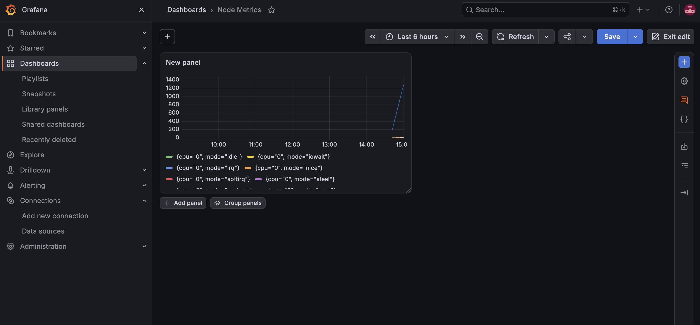
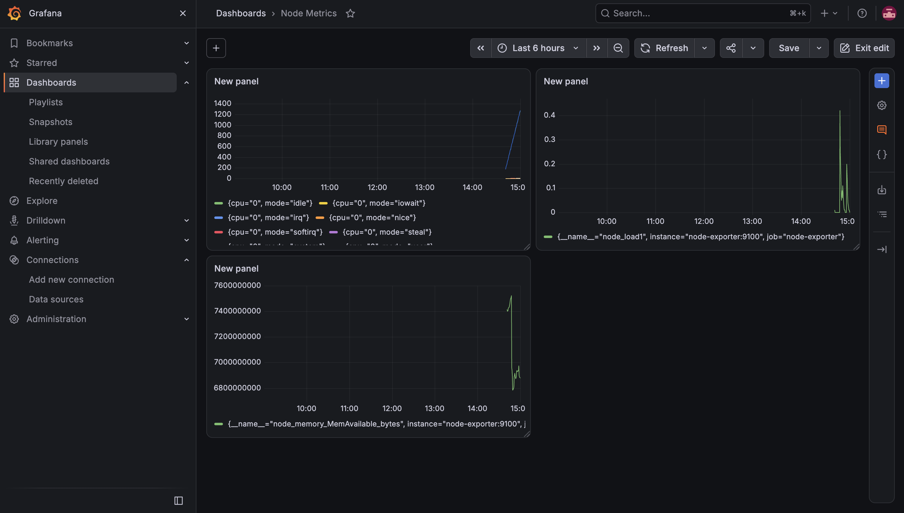
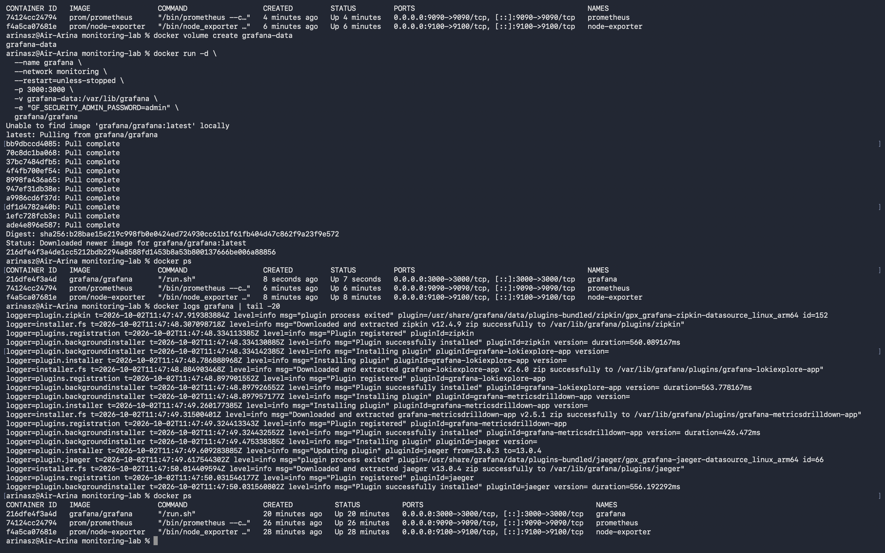

University: ITMO University
Faculty: FICT
Course: Введение в веб технологии
Year: 2025/2026
Group: u4225
Author: Тузовская Арина Сергеевна
Lab: Lab3
Date of create: 02.10.2026
Date of finished: 

## Цель работы

Научиться настраивать локальную систему мониторинга, собирать метрики с помощью Prometheus и создавать дашборды в Grafana для визуализации данных.

## Ход работы

### 1. Создание конфигурации Prometheus

Создана папка `monitoring-lab` с подпапкой `prometheus`, в которой размещён файл конфигурации `prometheus.yml`:

~~~yaml
global:
  scrape_interval: 15s

scrape_configs:
  - job_name: 'prometheus'
    static_configs:
      - targets: ['localhost:9090']

  - job_name: 'node-exporter'
    static_configs:
      - targets: ['node-exporter:9100']
~~~

Параметр `scrape_interval: 15s` означает, что Prometheus опрашивает все таргеты раз в 15 секунд.

### 2. Запуск Node Exporter

Создана Docker-сеть `monitoring` для взаимодействия контейнеров. Запущен контейнер Node Exporter, который собирает системные метрики:

~~~bash
docker network create monitoring

docker run -d \
  --name node-exporter \
  --network monitoring \
  --restart=unless-stopped \
  -p 9100:9100 \
  -v "/proc:/host/proc:ro" \
  -v "/sys:/host/sys:ro" \
  -v "/:/rootfs:ro" \
  prom/node-exporter \
  --path.procfs=/host/proc \
  --path.rootfs=/rootfs \
  --path.sysfs=/host/sys \
  --collector.filesystem.mount-points-exclude="^/(sys|proc|dev|host|etc)($$|/)"
~~~

Проверка работы:

~~~bash
curl http://localhost:9100/metrics | head -20
~~~

Метрики выводятся — Node Exporter работает корректно.

### 3. Запуск Prometheus

Создан том `prometheus-data` для хранения данных. Запущен контейнер Prometheus:

~~~bash
docker volume create prometheus-data

docker run -d \
  --name prometheus \
  --network monitoring \
  --restart=unless-stopped \
  -p 9090:9090 \
  -v prometheus-data:/prometheus \
  -v $(pwd)/prometheus:/etc/prometheus \
  prom/prometheus \
  --config.file=/etc/prometheus/prometheus.yml \
  --storage.tsdb.path=/prometheus \
  --web.console.libraries=/etc/prometheus/console_libraries \
  --web.console.templates=/etc/prometheus/consoles \
  --storage.tsdb.retention.time=200h \
  --web.enable-lifecycle
~~~

Проверка работы: страница Prometheus доступна по адресу `http://localhost:9090`.

На странице **Status → Targets** видны оба таргета со статусом **UP** — Prometheus успешно собирает метрики:

### 4. Запуск Grafana

Создан том `grafana-data` и запущен контейнер Grafana:

~~~bash
docker volume create grafana-data

docker run -d \
  --name grafana \
  --network monitoring \
  --restart=unless-stopped \
  -p 3000:3000 \
  -v grafana-data:/var/lib/grafana \
  -e "GF_SECURITY_ADMIN_PASSWORD=admin" \
  grafana/grafana
~~~

Grafana доступна по адресу `http://localhost:3000` (логин: `admin`, пароль: `admin`).

### 5. Настройка источника данных в Grafana

В Grafana добавлен источник данных Prometheus:

- **Configuration → Data Sources → Add data source**
- Тип: **Prometheus**
- **URL:** `http://prometheus:9090` (имя контейнера в сети `monitoring`)
- **Save & Test** — получено подтверждение: **«Successfully queried the Prometheus API»**

> Использование `http://prometheus:9090` вместо `http://localhost:9090` необходимо, потому что Grafana и Prometheus — разные контейнеры. Внутри контейнера Grafana `localhost` указывает на саму Grafana, а Docker DNS разрешает имя `prometheus` в IP-адрес соответствующего контейнера.

### 6. Создание дашборда

Создан дашборд `Node Metrics` с тремя панелями:

- **CPU** — метрика `node_cpu_seconds_total`
- **Memory** — метрика `node_memory_MemAvailable_bytes`
- **Load Average** — метрика `node_load1`

### 7. Финальная проверка

Все три контейнера запущены и работают:

~~~bash
docker ps
~~~

Список контейнеров:

- `node-exporter` — порт 9100
- `prometheus` — порт 9090
- `grafana` — порт 3000

## Вывод

В ходе лабораторной работы я настроила локальную систему мониторинга на основе Prometheus и Grafana, используя Docker для изоляции компонентов.

Были освоены:

- Настройка Prometheus через YAML-конфигурацию (`prometheus.yml`);
- Запуск Node Exporter для сбора системных метрик (CPU, память, диск, сеть);
- Создание Docker-сети для взаимодействия контейнеров по именам;
- Использование Docker volumes для персистентного хранения данных Prometheus и Grafana;
- Добавление источника данных в Grafana через URL контейнера (`http://prometheus:9090`);
- Создание дашбордов и панелей с метриками в Grafana;
- Проверка состояния таргетов на странице Prometheus → Status → Targets.

**Ключевой вывод:** Prometheus — это pull-based система мониторинга: она периодически сама опрашивает таргеты (через заданный в конфиге `scrape_interval`). Grafana — это визуализатор, который берёт данные из Prometheus и отображает их в виде графиков. Docker упрощает развёртывание всей системы: все компоненты запускаются одной командой и общаются друг с другом по именам контейнеров внутри одной сети. Использование volumes позволяет сохранить историю метрик и настройки дашбордов между перезапусками контейнеров.
